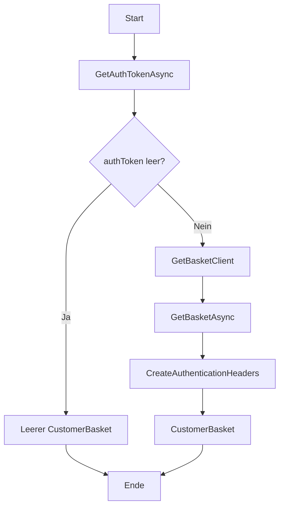

```mermaid
graph TD
    A[Start] --> B[GetAuthTokenAsync]
    B --> C{authToken leer?}
    C -->|Ja| D[Leerer CustomerBasket]
    C -->|Nein| E[GetBasketClient]
    E --> F[GetBasketAsync]
    F --> G[CreateAuthenticationHeaders]
    G --> H[CustomerBasket]
    D --> I[Ende]
    H --> I[Ende]
```