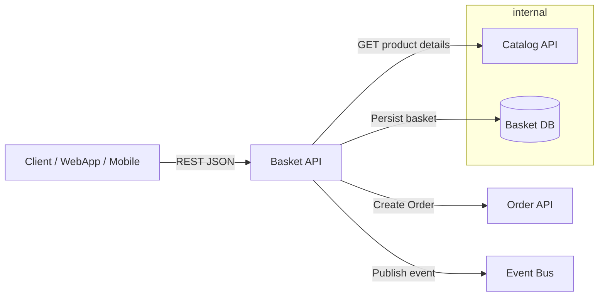

# Basket API — Dokumentation (Deutsch)

Diese Dokumentation beschreibt die Basket (Warenkorb) API des eShop-Projekts. Sie enthält eine Architekturübersicht, Endpunkte, Datenmodelle, Beispielanfragen/-antworten, Fehlercodes und ein zugehöriges Mermaid-Diagramm. Zielgruppe sind Entwickler, die die Basket-API nutzen oder weiterentwickeln.

## Übersicht

Die Basket API verwaltet Warenkörbe von Benutzern. Kernfunktionen:

- Warenkorb anlegen / abrufen
- Artikel hinzufügen, aktualisieren und entfernen
- Gesamtpreis und Mengenverwaltung
- Integration mit Produkt- und Order-Services

Die API exponiert REST-Endpoints (JSON) und kann sowohl von Client-Anwendungen als auch von anderen Microservices aufgerufen werden.

## Basket API — Dokumentation (Deutsch)

Diese Dokumentation beschreibt die Basket (Warenkorb) API des eShop-Projekts. Sie enthält eine Architekturübersicht, Endpunkte, Datenmodelle, Beispielanfragen/-antworten, Fehlercodes und ein zugehöriges Mermaid-Diagramm. Zielgruppe sind Entwickler, die die Basket-API nutzen oder weiterentwickeln.

### Übersicht

Die Basket API verwaltet Warenkörbe von Benutzern. Kernfunktionen:

- Warenkorb anlegen / abrufen
- Artikel hinzufügen, aktualisieren und entfernen
- Gesamtpreis und Mengenverwaltung
- Integration mit Produkt- und Order-Services

Die API exponiert REST-Endpoints (JSON) und kann sowohl von Client-Anwendungen als auch von anderen Microservices aufgerufen werden.

> Basis-URL (Beispiel): `https://{host}/api/v1/basket`

## Authentifizierung

Die API erwartet standardmäßig einen Bearer JWT-Token im Authorization-Header für geschützte Operationen:

```http
Authorization: Bearer <token>
```

Einige Leseendpunkte können optional öffentlich sein (je nach Deployment-Konfiguration).

## Endpunkte

Alle Antworten und Anforderungen verwenden `application/json`.

### 1) Erstelle oder aktualisiere Warenkorb

- Methode: POST
- URL: `/api/v1/basket`
- Beschreibung: Legt einen neuen Warenkorb an oder ersetzt den bestehenden Warenkorb des Benutzers.
- Request-Body (Beispiel):

```json
{
  "buyerId": "buyer-123",
  "items": [
    {
      "productId": "p-1",
      "productName": "T-Shirt",
      "unitPrice": 19.99,
      "quantity": 2,
      "pictureUrl": "/pics/tshirt.png"
    }
  ]
}
```

- Erfolgsantwort: 200 OK mit dem aktualisierten Warenkorb-Objekt.

### 2) Hole Warenkorb

- Methode: GET
- URL: `/api/v1/basket/{buyerId}`
- Beschreibung: Liefert den Warenkorb für den angegebenen `buyerId`.
- Erfolgsantwort (200):

```json
{
  "buyerId": "buyer-123",
  "items": [
    {
      "productId": "p-1",
      "productName": "T-Shirt",
      "unitPrice": 19.99,
      "quantity": 2,
      "pictureUrl": "/pics/tshirt.png"
    }
  ],
  "totalPrice": 39.98
}
```

### 3) Artikel zum Warenkorb hinzufügen

- Methode: PUT
- URL: `/api/v1/basket/items`
- Beschreibung: Fügt ein Item zum Warenkorb hinzu oder aktualisiert die Menge, wenn das Item bereits existiert.
- Request-Body (Beispiel):

```json
{
  "buyerId": "buyer-123",
  "productId": "p-2",
  "productName": "Kaffeetasse",
  "unitPrice": 7.5,
  "quantity": 1,
  "pictureUrl": "/pics/mug.png"
}
```

- Erfolgsantwort: 200 OK mit aktualisiertem Warenkorb.

### 4) Artikel aus Warenkorb entfernen

- Methode: DELETE
- URL: `/api/v1/basket/{buyerId}/items/{productId}`
- Beschreibung: Entfernt ein Item aus dem Warenkorb.
- Erfolgsantwort: 204 No Content (oder 200 OK mit aktualisiertem Warenkorb, je nach Implementierung).

### 5) Warenkorb leeren

- Methode: DELETE
- URL: `/api/v1/basket/{buyerId}`
- Beschreibung: Löscht den gesamten Warenkorb des Benutzers.
- Erfolgsantwort: 204 No Content.

## Datenmodell (vereinfacht)

- Basket

  - buyerId: string
  - items: BasketItem[]
  - totalPrice: decimal

- BasketItem
  - productId: string
  - productName: string
  - unitPrice: decimal
  - quantity: integer
  - pictureUrl?: string

## Beispiel: Fehlercodes

- 400 Bad Request — Ungültige Eingabe
- 401 Unauthorized — Fehlende/ungültige Authentifizierung
- 404 Not Found — Warenkorb oder Produkt nicht gefunden
- 409 Conflict — Wettbewerbskonflikt bei gleichzeitigen Änderungen
- 500 Internal Server Error — Unerwarteter Serverfehler

## Integration / Events

Die Basket-API kann Integration Events (z.B. beim Checkout) publizieren, z. B. `BasketCheckoutAccepted`. Diese Events werden üblicherweise an einen EventBus (z. B. RabbitMQ) gesendet, damit andere Services (Ordering, Payment) reagieren können.

## Sicherheitshinweise

- Validierung von Eingaben immer serverseitig durchführen.
- Preise sollten serverseitig berechnet/verifiziert werden, nicht blind aus dem Client übernommen werden.
- Rate-Limiting und Logging für verdächtige Aktivitäten in Betracht ziehen.

## Mermaid-Diagramm (eingebettet)

Untenstehend befindet sich ein vereinfachtes Architekturdiagramm als Mermaid-Flowchart. Eine separate `.mmd`-Datei ist im Projekt `Doku/Basket-API-diagram.mmd` abgelegt.



## Datei `Doku/Basket-API-diagram.mmd`

Die separate Datei enthält das Mermaid-Diagramm in vollständiger Form (siehe `Doku/Basket-API-diagram.mmd`).

## Weiteres / Hinweise

- Diese Dokumentation ist bewusst kompakt gehalten. Für tiefergehende Informationen (z.B. Auth-Lifecycle, detaillierte DTOs, Konfigurationsoptionen) siehe die jeweiligen Quellcode-Dateien unter `src/Basket.API/`.

---

Erstellt: automatisch generiert — bitte prüfen und bei Bedarf anpassen.

> Basis-URL (Beispiel): `https://{host}/api/v1/basket`

## Authentifizierung

Die API erwartet standardmäßig einen Bearer JWT-Token im Authorization-Header für geschützte Operationen:

```http
Authorization: Bearer <token>
```

Einige Leseendpunkte können optional öffentlich sein (je nach Deployment-Konfiguration).

## Endpunkte

Alle Antworten und Anforderungen verwenden `application/json`.

### 1) Erstelle oder aktualisiere Warenkorb

- Methode: POST
- URL: `/api/v1/basket`
- Beschreibung: Legt einen neuen Warenkorb an oder ersetzt den bestehenden Warenkorb des Benutzers.
- Request-Body (Beispiel):

```json
{
  "buyerId": "buyer-123",
  "items": [
    {
      "productId": "p-1",
      "productName": "T-Shirt",
      "unitPrice": 19.99,
      "quantity": 2,
      "pictureUrl": "/pics/tshirt.png"
    }
  ]
}
```

- Erfolgsantwort: 200 OK mit dem aktualisierten Warenkorb-Objekt.

### 2) Hole Warenkorb

- Methode: GET
- URL: `/api/v1/basket/{buyerId}`
- Beschreibung: Liefert den Warenkorb für den angegebenen `buyerId`.
- Erfolgsantwort (200):

```json
{
  "buyerId": "buyer-123",
  "items": [
    {
      "productId": "p-1",
      "productName": "T-Shirt",
      "unitPrice": 19.99,
      "quantity": 2,
      "pictureUrl": "/pics/tshirt.png"
    }
  ],
  "totalPrice": 39.98
}
```

### 3) Artikel zum Warenkorb hinzufügen

- Methode: PUT
- URL: `/api/v1/basket/items`
- Beschreibung: Fügt ein Item zum Warenkorb hinzu oder aktualisiert die Menge, wenn das Item bereits existiert.
- Request-Body (Beispiel):

```json
{
  "buyerId": "buyer-123",
  "productId": "p-2",
  "productName": "Kaffeetasse",
  "unitPrice": 7.5,
  "quantity": 1,
  "pictureUrl": "/pics/mug.png"
}
```

- Erfolgsantwort: 200 OK mit aktualisiertem Warenkorb.

### 4) Artikel aus Warenkorb entfernen

- Methode: DELETE
- URL: `/api/v1/basket/{buyerId}/items/{productId}`
- Beschreibung: Entfernt ein Item aus dem Warenkorb.
- Erfolgsantwort: 204 No Content (oder 200 OK mit aktualisiertem Warenkorb, je nach Implementierung).

### 5) Warenkorb leeren

- Methode: DELETE
- URL: `/api/v1/basket/{buyerId}`
- Beschreibung: Löscht den gesamten Warenkorb des Benutzers.
- Erfolgsantwort: 204 No Content.

## Datenmodell (vereinfacht)

- Basket

  - buyerId: string
  - items: BasketItem[]
  - totalPrice: decimal

- BasketItem
  - productId: string
  - productName: string
  - unitPrice: decimal
  - quantity: integer
  - pictureUrl?: string

## Beispiel: Fehlercodes

- 400 Bad Request — Ungültige Eingabe
- 401 Unauthorized — Fehlende/ungültige Authentifizierung
- 404 Not Found — Warenkorb oder Produkt nicht gefunden
- 409 Conflict — Wettbewerbskonflikt bei gleichzeitigen Änderungen
- 500 Internal Server Error — Unerwarteter Serverfehler

## Integration / Events

Die Basket-API kann Integration Events (z.B. beim Checkout) publizieren, z. B. `BasketCheckoutAccepted`. Diese Events werden üblicherweise an einen EventBus (z. B. RabbitMQ) gesendet, damit andere Services (Ordering, Payment) reagieren können.

## Sicherheitshinweise

- Validierung von Eingaben immer serverseitig durchführen.
- Preise sollten serverseitig berechnet/verifiziert werden, nicht blind aus dem Client übernommen werden.
- Rate-Limiting und Logging für verdächtige Aktivitäten in Betracht ziehen.

## Mermaid-Diagramm (eingebettet)

Untenstehend befindet sich ein vereinfachtes Architekturdiagramm als Mermaid-Flowchart. Eine separate `.mmd`-Datei ist im Projekt `Doku/Basket-API-diagram.mmd` abgelegt.


## Datei `Doku/Basket-API-diagram.mmd`

Die separate Datei enthält das Mermaid-Diagramm in vollständiger Form (siehe `Doku/Basket-API-diagram.mmd`).

## Weiteres / Hinweise

- Diese Dokumentation ist bewusst kompakt gehalten. Für tiefergehende Informationen (z.B. Auth-Lifecycle, detaillierte DTOs, Konfigurationsoptionen) siehe die jeweiligen Quellcode-Dateien unter `src/Basket.API/`.

---

Erstellt: automatisch generiert — bitte prüfen und bei Bedarf anpassen.
