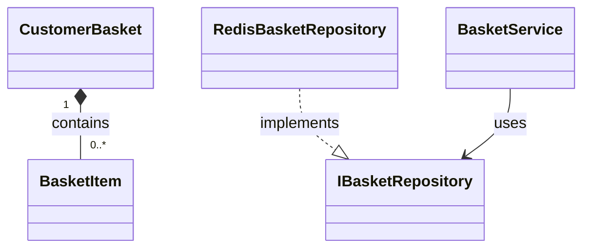

# 📚 Add Comprehensive Documentation for Basket.API Module

## 🎯 Summary

This PR adds comprehensive documentation for the Basket.API module to improve developer experience and code maintainability. The documentation includes detailed class references, architectural diagrams, and practical usage examples.

## 📋 Changes

| Type | File | Description |
|------|------|-------------|
| ✅ **New** | `src/Basket.API/Model/BasketItem.md` | Complete class documentation with examples |
| ✅ **New** | `src/Basket.API/ClassDiagram.md` | UML class diagram with Mermaid |
| 🔧 **Modified** | `src/Basket.API/Model/BasketItem.cs` | Enhanced XML documentation |

## 📖 What's Included

### 🏗️ BasketItem Class Documentation
- **Complete API Reference** - All properties and methods documented
- **Validation Rules** - Custom validation logic explained
- **Usage Examples** - Real-world code snippets for:
  - Creating new BasketItem instances
  - Validating user input
  - Price calculations and comparisons
- **Best Practices** - Recommended patterns and approaches

### 🎨 Architecture Documentation
- **UML Class Diagram** - Complete visual overview using Mermaid
- **Component Relationships** - How classes interact
- **Repository Pattern** - Data access implementation
- **gRPC Service Layer** - API service structure
- **Integration Events** - Microservice communication patterns
- **Data Flow** - Request/response lifecycle

## 🎯 Benefits

### 👨‍💻 For New Developers
- ✅ Quick onboarding to Basket.API functionality
- ✅ Clear understanding of architecture patterns
- ✅ Ready-to-use code examples

### 🔧 For Existing Developers  
- ✅ Reference for complex validation logic
- ✅ Overview of service dependencies
- ✅ Documented best practices

### 🏗️ For System Architecture
- ✅ Visual representation of component relationships
- ✅ Clear separation of concerns
- ✅ Integration patterns documentation

## 🔍 Technical Highlights

### 📊 Architecture Patterns

### 🛡️ Validation Features
- **Quantity Validation**: Must be >= 1
- **Custom Validation**: IValidatableObject implementation
- **Error Handling**: Structured ValidationResult responses

### 🗄️ Data Persistence
- **Redis Storage**: JSON serialization with System.Text.Json
- **Key Pattern**: `/basket/{userId}` for efficient lookups
- **Performance**: Native AOT-compatible serialization

## ✅ Quality Assurance

### 📝 Documentation Standards
- **Markdown Format**: Consistent documentation structure
- **Mermaid Diagrams**: Interactive UML diagrams
- **Code Examples**: Practical implementation samples
- **XML Documentation**: Enhanced IntelliSense support

### 🧪 Impact Assessment
- ❌ **No Breaking Changes**
- ✅ **Pure Documentation Addition**
- ✅ **Existing Functionality Unchanged**
- ✅ **Improved Developer Experience**

## 📋 Checklist

- [x] BasketItem class documentation created
- [x] UML class diagram implemented
- [x] XML documentation enhanced
- [x] Code examples added
- [x] Best practices documented
- [x] Architecture patterns explained
- [x] Integration events documented
- [x] Validation rules clarified

## 🎉 Conclusion

This documentation enhancement makes the Basket.API module more accessible and maintainable for developers. It follows modern documentation standards and provides both practical examples and architectural insights essential for understanding the microservice's design and implementation.

---
**Type**: 📚 Documentation  
**Scope**: Basket.API Module  
**Breaking Changes**: ❌ None  
**Review Focus**: Documentation quality and completeness