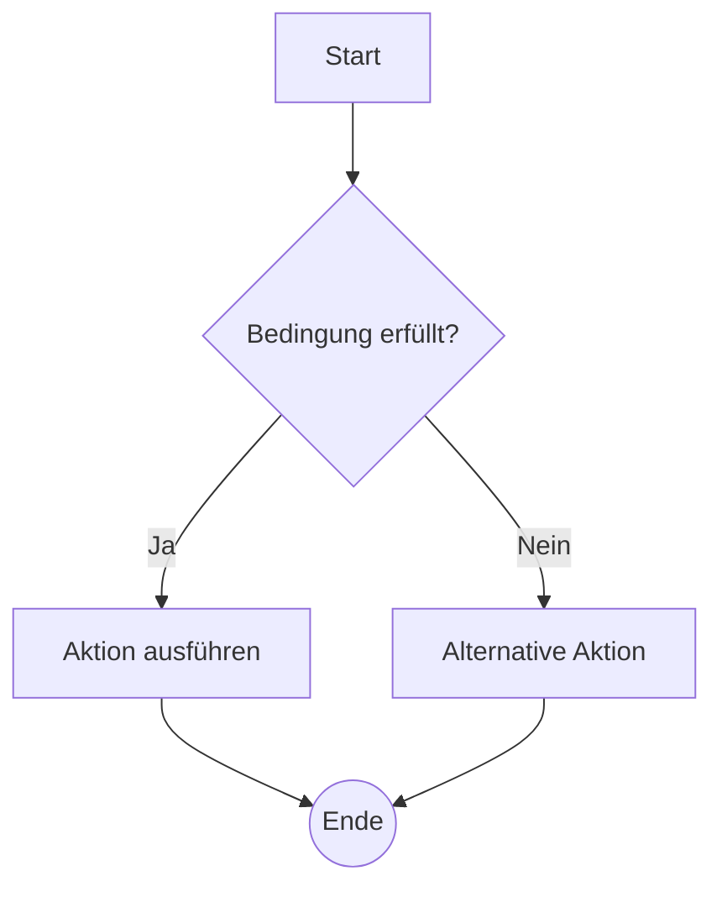

```mermaid
flowchart TD
    Start --> Entscheidung{Bedingung erfüllt?}
    Entscheidung -- Ja --> Aktion1[Aktion ausführen]
    Entscheidung -- Nein --> Aktion2[Alternative Aktion]
    Aktion1 --> Ende
    Aktion2 --> Ende
    Ende((Ende))
```
