# Klassendiagramm - eShop.Basket.API

## UML Klassendiagramm

```mermaid
classDiagram
    %% Model Classes
    class BasketItem {
        +string Id
        +int ProductId
        +string ProductName
        +decimal UnitPrice
        +decimal OldUnitPrice
        +int Quantity
        +string PictureUrl
        +Validate(ValidationContext) IEnumerable~ValidationResult~
    }

    class CustomerBasket {
        +string BuyerId
        +List~BasketItem~ Items
        +CustomerBasket()
        +CustomerBasket(string customerId)
    }

    %% Repository Interface and Implementation
    class IBasketRepository {
        <<interface>>
        +GetBasketAsync(string customerId) Task~CustomerBasket~
        +UpdateBasketAsync(CustomerBasket basket) Task~CustomerBasket~
        +DeleteBasketAsync(string id) Task~bool~
    }

    class RedisBasketRepository {
        -IDatabase _database
        -RedisKey BasketKeyPrefix
        +GetBasketAsync(string customerId) Task~CustomerBasket~
        +UpdateBasketAsync(CustomerBasket basket) Task~CustomerBasket~
        +DeleteBasketAsync(string id) Task~bool~
        -GetBasketKey(string userId) RedisKey
    }

    %% Serialization Context
    class BasketSerializationContext {
        <<JsonSerializerContext>>
        +CustomerBasket
    }

    %% gRPC Service
    class BasketService {
        -IBasketRepository repository
        -ILogger~BasketService~ logger
        +GetBasket(GetBasketRequest, ServerCallContext) Task~CustomerBasketResponse~
        +UpdateBasket(UpdateBasketRequest, ServerCallContext) Task~CustomerBasketResponse~
        +DeleteBasket(DeleteBasketRequest, ServerCallContext) Task~DeleteBasketResponse~
        -MapToCustomerBasketResponse(CustomerBasket) CustomerBasketResponse
        -MapToCustomerBasket(string, UpdateBasketRequest) CustomerBasket
        -ThrowNotAuthenticated() void
        -ThrowBasketDoesNotExist(string) void
    }

    %% gRPC Messages (Proto)
    class GetBasketRequest {
        <<proto>>
    }

    class CustomerBasketResponse {
        <<proto>>
        +repeated BasketItem items
    }

    class UpdateBasketRequest {
        <<proto>>
        +repeated BasketItem items
    }

    class DeleteBasketRequest {
        <<proto>>
    }

    class DeleteBasketResponse {
        <<proto>>
    }

    class BasketItemProto {
        <<proto>>
        +int32 product_id
        +int32 quantity
    }

    %% Integration Events
    class OrderStartedIntegrationEvent {
        <<record>>
        +string UserId
    }

    class OrderStartedIntegrationEventHandler {
        -IBasketRepository repository
        -ILogger~OrderStartedIntegrationEventHandler~ logger
        +Handle(OrderStartedIntegrationEvent) Task
    }

    %% External Interfaces
    class IValidatableObject {
        <<interface>>
        +Validate(ValidationContext) IEnumerable~ValidationResult~
    }

    class IntegrationEvent {
        <<abstract>>
        +Guid Id
        +DateTime CreationDate
    }

    class IIntegrationEventHandler~T~ {
        <<interface>>
        +Handle(T @event) Task
    }

    %% Extensions
    class ServerCallContextIdentityExtensions {
        <<static>>
        +GetUserIdentity(ServerCallContext) string
    }

    %% Relationships
    CustomerBasket "1" *-- "0..*" BasketItem : contains
    BasketItem ..|> IValidatableObject : implements
    
    RedisBasketRepository ..|> IBasketRepository : implements
    RedisBasketRepository --> CustomerBasket : uses
    RedisBasketRepository --> BasketSerializationContext : uses
    
    BasketService --> IBasketRepository : uses
    BasketService --> CustomerBasket : uses
    BasketService --> GetBasketRequest : uses
    BasketService --> CustomerBasketResponse : returns
    BasketService --> UpdateBasketRequest : uses
    BasketService --> DeleteBasketRequest : uses
    BasketService --> DeleteBasketResponse : returns
    BasketService --> ServerCallContextIdentityExtensions : uses
    
    CustomerBasketResponse "1" *-- "0..*" BasketItemProto : contains
    UpdateBasketRequest "1" *-- "0..*" BasketItemProto : contains
    
    OrderStartedIntegrationEvent --|> IntegrationEvent : extends
    OrderStartedIntegrationEventHandler ..|> IIntegrationEventHandler~T~ : implements
    OrderStartedIntegrationEventHandler --> IBasketRepository : uses
    OrderStartedIntegrationEventHandler --> OrderStartedIntegrationEvent : handles

    %% Dependencies
    BasketSerializationContext --> CustomerBasket : serializes

    %% Stereotypes and Notes
    note for BasketItem "Validates quantity >= 1"
    note for RedisBasketRepository "Stores baskets in Redis with key pattern /basket/{userId}"
    note for BasketService "gRPC service for basket operations"
    note for OrderStartedIntegrationEventHandler "Clears basket when order starts"
```

## Architektur-Übersicht

### 📋 **Model Layer**
- **`BasketItem`**: Einzelner Artikel im Warenkorb mit Validierung
- **`CustomerBasket`**: Container für Warenkorb-Artikel eines Kunden

### 🗄️ **Repository Layer**
- **`IBasketRepository`**: Interface für Warenkorb-Operationen
- **`RedisBasketRepository`**: Redis-basierte Implementierung mit JSON-Serialisierung

### 🌐 **Service Layer (gRPC)**
- **`BasketService`**: gRPC-Service für Warenkorb-API
- **Proto Messages**: Strukturierte Datenübertragung zwischen Client und Server

### 🔄 **Integration Events**
- **`OrderStartedIntegrationEvent`**: Event wenn Bestellung gestartet wird
- **`OrderStartedIntegrationEventHandler`**: Löscht Warenkorb nach Bestellstart

### 🛠️ **Support Classes**
- **`BasketSerializationContext`**: JSON-Serialisierung für Performance
- **`ServerCallContextIdentityExtensions`**: Benutzer-Identifikation aus gRPC-Kontext

## 🔄 Datenfluss

1. **Client** → gRPC Request → **BasketService**
2. **BasketService** → **IBasketRepository** → **RedisBasketRepository**
3. **RedisBasketRepository** ↔ **Redis Database** (JSON serialisiert)
4. **BasketService** ← **CustomerBasket/BasketItem** ← **RedisBasketRepository**
5. **BasketService** → gRPC Response → **Client**

## 🎯 Wichtige Beziehungen

- **Aggregation**: `CustomerBasket` enthält mehrere `BasketItem`
- **Implementation**: `RedisBasketRepository` implementiert `IBasketRepository`
- **Dependency**: `BasketService` nutzt `IBasketRepository` (Dependency Injection)
- **Event Handling**: `OrderStartedIntegrationEventHandler` reagiert auf Integration Events
- **Validation**: `BasketItem` implementiert `IValidatableObject` für benutzerdefinierte Validierung

## 📦 Externe Abhängigkeiten

- **Redis**: Für Persistierung der Warenkörbe
- **gRPC**: Für Service-Kommunikation
- **System.Text.Json**: Für Serialisierung
- **Integration Events**: Für Microservice-Kommunikation
